<div align="center">

# 🤖 AILC-Company
## *Agentic Intelligent Lifeform Company*
### **Revolutionizing Software Development Through AI Autonomy**

[](https://git.io/typing-svg)


</div>

---

## 🧠 What is AILC?

<div>


**AILC (Agentic Intelligent Lifeform Company)** is a groundbreaking organization where **every business function is autonomously managed by specialized AI agents**. We're not just using AI as a tool — we ARE an AI-driven ecosystem.

Our revolutionary approach eliminates traditional bottlenecks by deploying intelligent agents across all organizational levels, from customer engagement to final product delivery. This creates unprecedented consistency, efficiency, and scalability in software development.

```typescript
const AILC = {
  mission: "Autonomous AI-driven software development",
  model: "100% Agent-based organizational structure",
  expertise: ["Windows Applications", "Web Development"],
  advantage: "Zero human dependency for digital services",
  vision: "Living AI ecosystem that learns and evolves",
  status: "Pioneering the future of work"
};
```

> **"AILC is not just a company — it's a living AI ecosystem that thinks, learns, and delivers."**

</div>

---

## 🌐 Areas of Expertise

<div align="center">

### We Build Exceptional Software For:

<table>
<tr>
<td align="center" width="50%">

### 🪟 Windows Applications


**Desktop Solutions That Excel**
- Native Windows performance
- Modern UI/UX design
- Cross-platform compatibility
- Enterprise-grade security

</td>
<td align="center" width="50%">

### 🌐 Web Applications


**Web Solutions That Scale**
- Responsive design systems
- Cloud-native architecture
- AI-powered features
- Real-time capabilities

</td>
</tr>
</table>

</div>

---

## 🛠️ AI-Powered Organizational Structure

<div align="center">

</div>

### Every role is an autonomous AI agent working in perfect harmony:

<table>
<tr>
<td width="50%">

| 🎯 **Strategic Agents** | **Function** |
|-------------------------|--------------|
| 🧑‍💼 **CEO Agent** | Company strategy & vision |
| 📦 **Product Owner** | Product roadmap & requirements |
| 📋 **Project Manager** | Timeline & resource optimization |
| 👥 **Customer Manager** | Client relations & support |

| 💻 **Development Agents** | **Function** |
|---------------------------|--------------|
| 💻 **Code Developer** | Full-stack development |
| 🎨 **UI/UX Designer** | Interface design & UX |
| 🧩 **Backend Developer** | Server-side architecture |
| 🎯 **Frontend Developer** | Client-side implementation |

</td>
<td width="50%">

| 🔧 **Operations Agents** | **Function** |
|--------------------------|--------------|
| 📝 **Project Intake** | Request processing |
| 🗂️ **Project Registrar** | Documentation & categorization |
| 🏠 **Internal Web Admin** | Platform maintenance |
| 🔄 **AI Knowledge Updater** | System learning & updates |

| 🚀 **Innovation Agents** | **Function** |
|--------------------------|--------------|
| ✍️ **Prompt Engineer** | AI optimization specialist |
| 🔄 **Fullstack Developer** | End-to-end solutions |
| 📊 **Analytics Agent** | Performance monitoring |
| 🛡️ **Security Agent** | System protection |

</td>
</tr>
</table>

---

## 🌟 Our Revolutionary Vision

<div>


At AILC, we're building tomorrow's workforce today. Our autonomous agents represent the evolution of software development:

### 🚀 **Continuous Evolution**
- **Self-Learning Systems**: Agents improve through every interaction
- **Adaptive Workflows**: Processes optimize automatically based on performance data
- **Predictive Development**: AI anticipates project needs before they arise

### ⚡ **Unmatched Efficiency** 
- **24/7 Operations**: Never-sleeping development cycles
- **Zero Communication Overhead**: Perfect agent-to-agent coordination
- **Instant Scaling**: Dynamic resource allocation based on demand

### 🎯 **Consistent Excellence**
- **Standardized Quality**: Every deliverable meets exact specifications
- **Error Elimination**: AI-powered testing and validation at every step
- **Knowledge Retention**: Institutional memory that never degrades

</div>

---

## 📈 AI-Driven Company Workflow

```mermaid
graph TD
    A["🌐 Client Request"] --> B["📝 Project Intake Agent"]
    B --> C["🗂️ Project Registrar"]
    C --> D["📦 Product Owner"]
    D --> E["🎨 UI/UX Designer"]
    D --> F["🧩 Backend Developer"]
    D --> G["🎯 Frontend Developer"]
    E --> H["💻 Code Developer"]
    F --> H
    G --> H
    H --> I["📋 Project Manager"]
    I --> J["👥 Customer Manager"]
    J --> K["🚀 Product Delivery"]
    
    L["🧑‍💼 CEO Agent"] --> D
    L --> I
    M["✍️ Prompt Engineer"] --> E
    M --> F
    M --> G
    N["🔄 AI Knowledge Updater"] --> L
    N --> M
    
    style A fill:#6366f1,stroke:#4f46e5,color:#fff
    style K fill:#10b981,stroke:#059669,color:#fff
    style L fill:#f59e0b,stroke:#d97706,color:#fff
```



---

## 🏆 Why Choose AILC?

<div align="center">

<table>
<tr>
<td align="center" width="25%">

### ⚡ Speed


**Lightning-Fast Delivery**
- Parallel processing
- No human delays
- 24/7 development cycles

</td>
<td align="center" width="25%">

### 🎯 Precision


**Pixel-Perfect Results**
- Zero miscommunication
- Exact specification adherence
- Consistent quality standards

</td>
<td align="center" width="25%">

### 📈 Scalability


**Infinite Growth Potential**
- Dynamic resource allocation
- Instant team scaling
- Global deployment ready

</td>
<td align="center" width="25%">

### 🧠 Intelligence


**Continuous Learning**
- Self-improving systems
- Predictive capabilities
- Knowledge accumulation

</td>
</tr>
</table>

</div>

---

## 🛡️ Our Technology Stack

<div align="center">

### Core Technologies Powering Our AI Agents


</div>

---

## 📊 Company Metrics

<div align="center">


[](https://git.io/streak-stats)

</div>

---

## 🤝 Join the AI Revolution

<div align="center">

### Ready to experience the future of software development?

[](mailto:agents@ailc-company.com)
[](https://github.com/ailc-company)
[](https://docs.ailc-company.com)

**🌐 Let our AI agents transform your ideas into exceptional software**


</div>

---

<div align="center">


**🤖 Powered by Autonomous Intelligence | Built for the Future | Delivered Today 🚀**

</div>
